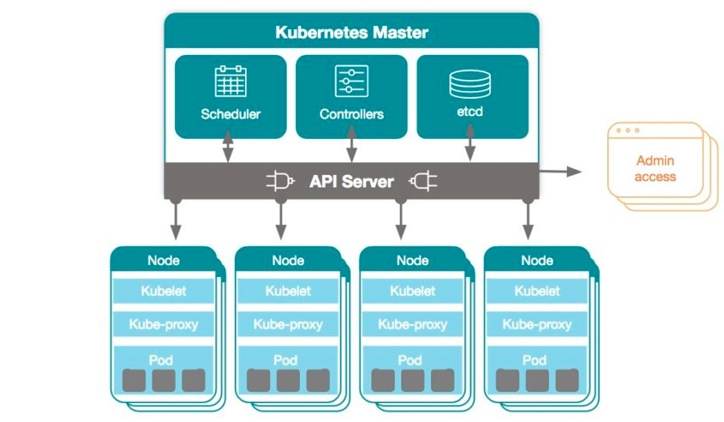
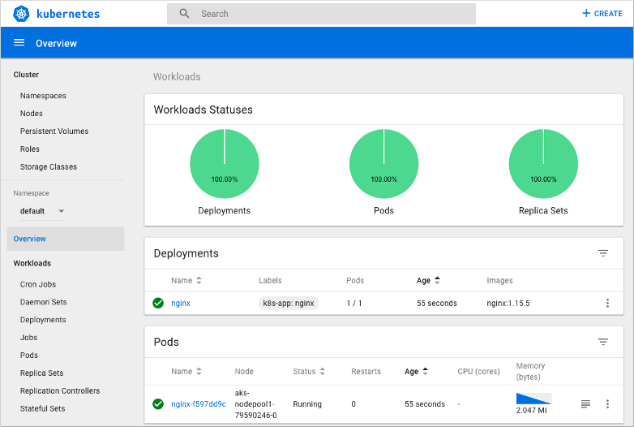

# Kubernetes 

<h4>Origen</h4>

* Creado por Google en 2014.
* Sucesor de Borg de Google.
* El proyecto se iba  a llamar project seven (por eso también los 7 rayos en el logo)  haciendo referencia a un personaje de Star Wars que es un borg, pero más amigable.
* Donado y salida de la primer version en manos de la Linux Foundation en 2015.

<h4>Qué es?</h4>

* Plataforma portable y extensible de código abierto para automatizar las operaciones de contenedores.
* Administra cargas de trabajo y servicios. 
* Facilita la automatización y la configuración declarativa. 
* Tiene un ecosistema grande y en rápido crecimiento. El soporte, las herramientas y los servicios para Kubernetes están ampliamente disponibles.
* Ofrece la simplicidad de las PaaS con la flexibilidad de la IaaS y permite la portabilidad entre proveedores de infraestructura.
* Permite crear cluster de contenedores y facilita su administración.
* Abarca host de nube pública, híbrida u on-premises.
* Es flexible y no diferencia aplicaciones

<h4>Arquitectura de Kubernetes</h4>

<h4>Características principales</h4>

* Descubrimiento de servicios y balanceo de carga
* Auto Reparación
* Despliegues y rollbacks automáticos
* Planificación
* Escalar las aplicaciones en contenedores y sus recursos sobre la marcha.
* Orquestación del almacenamiento
* Ejecución batch
* Observabilidad

<h4>Comenzar a usar K8s</h4>

Decidir dónde ejecutar Kubernetes. Dependiendo de nuestros recursos, características del cluster y flexibilidad necesaria.
a) En la nube mediante un cloud provider
b) Máquinas virtuales
c) En nuestro data center de manera on-premises
d) Equipo local

